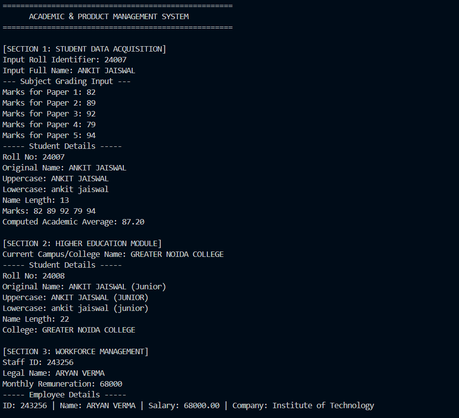
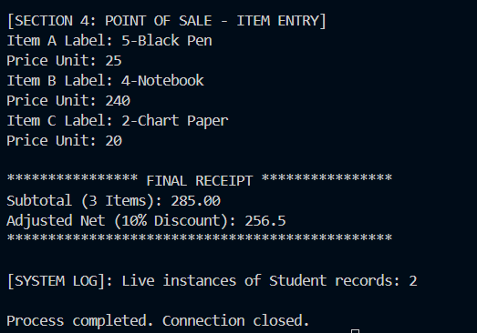

# Student Product Billing & Management System

## 👤 Personal Information
*   **Name:** ANKIT JAISWAL
*   **Date:** April 13, 2026

---

## 🚀 Concepts Used
This project demonstrates proficiency in the following Java core concepts as per the assignment requirements:

*   **Object-Oriented Programming (OOP):** Implementation of **Inheritance** (`AjCollegeStudent` extends `AjStudent`) and **Encapsulation** (Private variables in `AjProduct`).
*   **Constructors & `this` Keyword:** Used in the `AjEmployee` class for efficient object initialization.
*   **Method Overloading:** Implemented in `AjProductBilling` to handle different types of billing calculations.
*   **Arrays & Strings:** Used for managing student mark records and handling text formatting.
*   **Static Variables:** Used for shared data across class instances.

---

## 🛠️ Execution Instructions
Follow these steps to run the project correctly in **VS Code**:

1.  **File Preparation:** Ensure all `.java` files (AjStudent, AjCollegeStudent, AjEmployee,Aj Product, AjProductBilling, and AjMain) are saved within the same `src` folder.
2.  **Open Workspace:** Open the `src` folder in VS Code to ensure all dependencies are recognized by the Java Language Server.
3.  **Load Files:** Open all source files in the editor tabs to verify the project structure.
4.  **Run Application:** 
    *   Navigate to the `AjMain.java` file.
    *   Click the **Run** button (Play icon) in the top-right corner, or use the terminal:
    ```bash
    javac AjMain.java
    java AjMain
    ```

---

## 📊 Sample Output
The following screenshot confirms that the application executes all user stories successfully, showing the student details, employee information, and calculated product bills.




---
